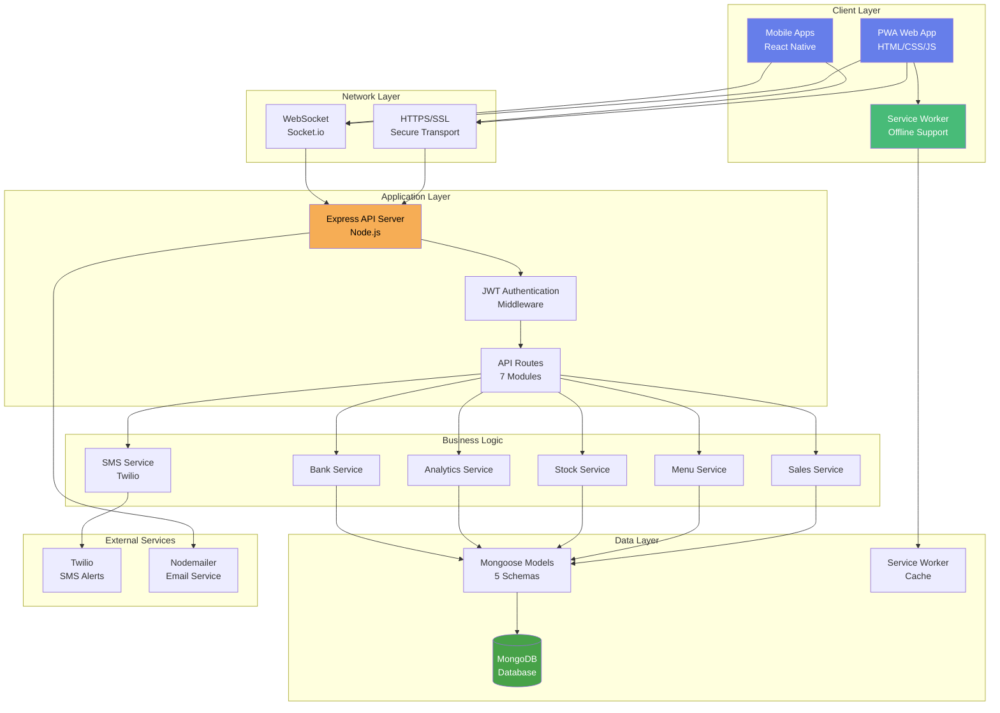
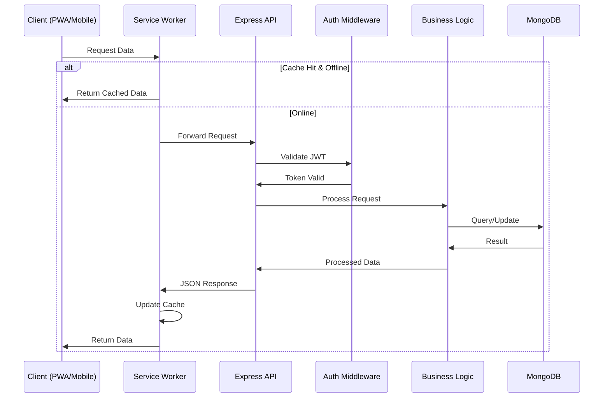
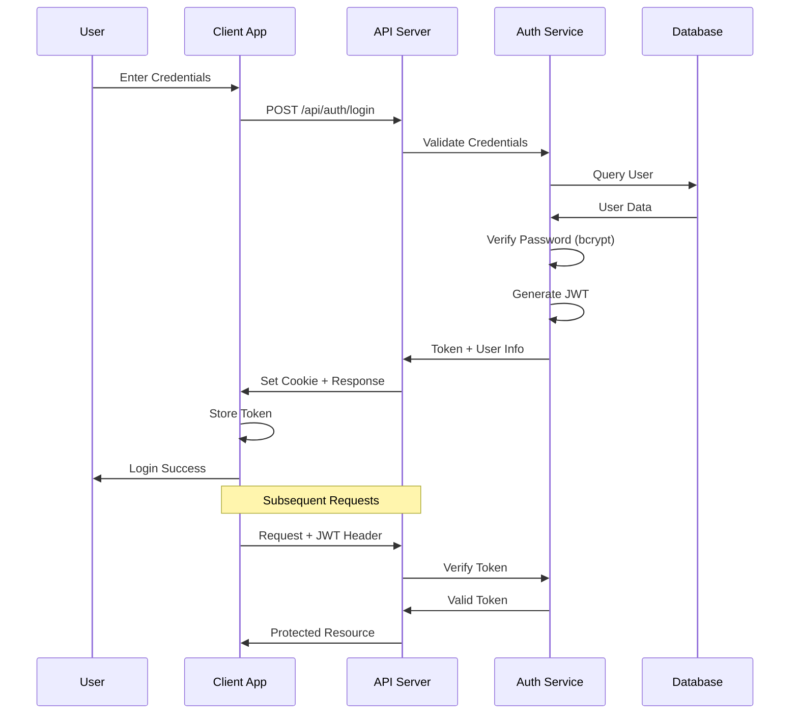
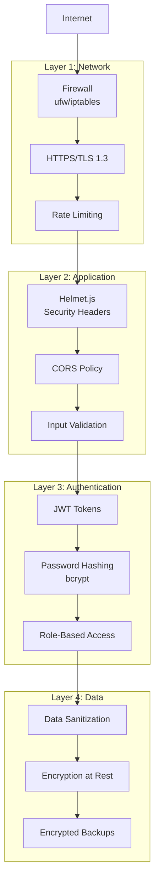
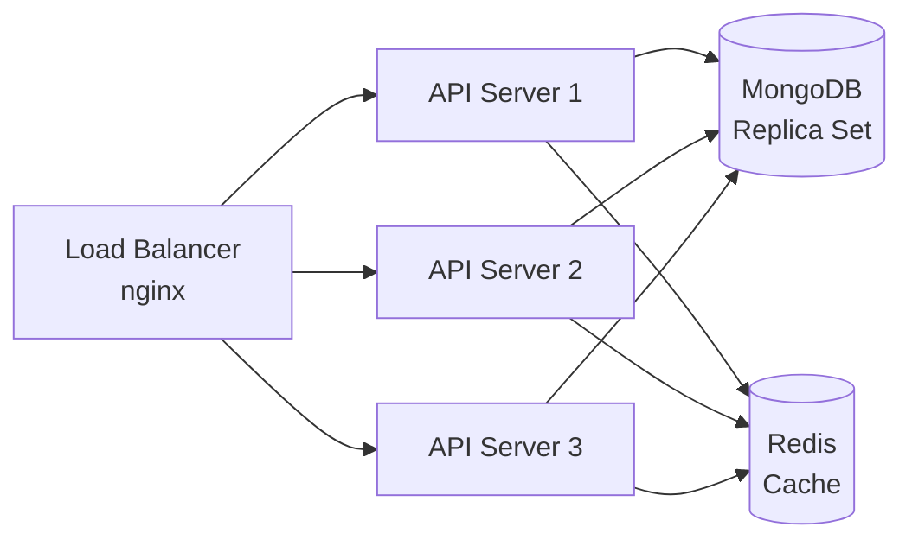
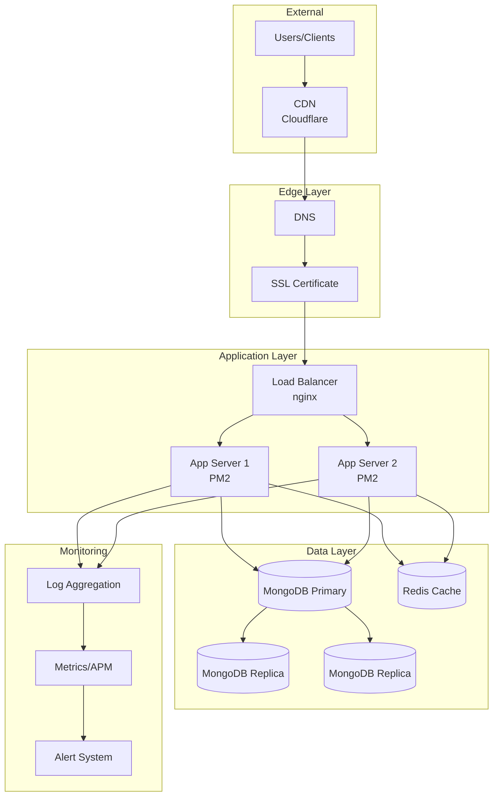
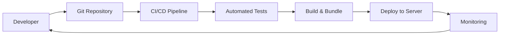

# BarTrack POS - System Architecture

## Overview
BarTrack POS is a modern, full-stack bar management system built with a Progressive Web App (PWA) architecture for maximum accessibility and performance.

---

## System Architecture Diagram

---

## Component Details

### 1. Client Layer

#### Progressive Web App (PWA)
- **Technology**: Vanilla JavaScript, Modern CSS
- **Features**: 
  - Installable on all platforms
  - Offline-first architecture
  - Responsive design
  - Glassmorphism UI
  - 60fps animations
- **Files**: `index.html`, `main.js`, `style.css`

#### Mobile Apps
- **Technology**: React Native
- **Platforms**: iOS & Android
- **Features**:
  - Native performance
  - Platform-specific UI
  - Offline capabilities
  - Push notifications
- **Location**: `/mobile`

#### Service Worker
- **File**: `service-worker.js`
- **Capabilities**:
  - Asset precaching
  - Runtime caching
  - Background sync
  - Push notifications
  - Offline fallbacks

### 2. Network Layer

#### HTTPS/SSL
- **Purpose**: Secure communication
- **Requirements**: Required for PWA features
- **Implementation**: nginx/Apache reverse proxy

#### WebSocket (Socket.io)
- **Purpose**: Real-time bidirectional communication
- **Use Cases**:
  - Live sales updates
  - Stock level changes
  - User notifications
  - Dashboard metrics

### 3. Application Layer

#### Express API Server
- **Port**: 5000 (configurable)
- **Features**:
  - RESTful API design
  - JSON responses
  - Error handling
  - Request validation
  - CORS support
  - Compression
  - Security headers (Helmet)

#### JWT Authentication
- **Strategy**: Bearer token
- **Storage**: HTTP-only cookies (recommended) or localStorage
- **Expiration**: Configurable (default 24h)
- **Roles**: Admin, Manager, Bartender, Waiter, Cashier

#### API Routes (7 Modules)
1. **auth.js** - Authentication endpoints
2. **sales.js** - Sales management
3. **menu.js** - Menu operations
4. **stock.js** - Inventory management
5. **analytics.js** - Reporting and metrics
6. **bank.js** - Bank reconciliation
7. **users.js** - User management

### 4. Business Logic Layer

#### Services
Each service encapsulates specific business logic:

- **Sales Service**: Transaction processing, receipt generation
- **Menu Service**: Item management, categorization
- **Stock Service**: Inventory tracking, variance detection
- **Analytics Service**: Report generation, metrics calculation
- **Bank Service**: Transaction matching, reconciliation
- **SMS Service**: Alert notifications via Twilio

### 5. Data Layer

#### MongoDB Database
- **Type**: NoSQL document database
- **Driver**: Mongoose ODM
- **Features**:
  - Schema validation
  - Relationships
  - Indexing
  - Aggregation pipelines

#### Mongoose Models (5 Schemas)
1. **User**: Authentication and profile data
2. **MenuItem**: Menu items and pricing
3. **Sale**: Transaction records
4. **StockMovement**: Inventory changes
5. **BankTransaction**: Bank reconciliation data

#### Service Worker Cache
- **Strategy**: Cache-first for static assets
- **Strategy**: Network-first for API calls
- **Fallback**: Cached data when offline

### 6. External Services

#### Twilio (SMS)
- **Purpose**: Send SMS alerts
- **Use Cases**:
  - Low stock alerts
  - High-value sales
  - Daily summaries
- **Status**: Demo mode available

#### Nodemailer (Email)
- **Purpose**: Email notifications
- **Use Cases**:
  - Reports
  - Receipts
  - Alerts
- **Configuration**: SMTP settings in .env

---

## Data Flow

### Typical Request Flow

### Authentication Flow

---

## Technology Stack

### Frontend
| Component | Technology | Purpose |
|-----------|-----------|---------|
| UI Framework | Vanilla JS | Lightweight, no dependencies |
| Styling | Modern CSS | Glassmorphism, animations |
| Fonts | Google Fonts (Inter) | Professional typography |
| Icons | (TBD) | UI icons |
| PWA | Service Worker + Manifest | Offline, installable |
| Real-time | Socket.io Client | Live updates |

### Backend
| Component | Technology | Purpose |
|-----------|-----------|---------|
| Runtime | Node.js 18+ | Server execution |
| Framework | Express.js | API routing |
| Database | MongoDB | Data persistence |
| ODM | Mongoose | Schema modeling |
| Auth | JWT + bcrypt | Secure authentication |
| WebSockets | Socket.io | Real-time comm |
| Validation | express-validator | Input validation |
| Security | Helmet.js | HTTP headers |
| SMS | Twilio | Text alerts |
| Email | Nodemailer | Email service |

### Mobile
| Component | Technology | Purpose |
|-----------|-----------|---------|
| Framework | React Native | Cross-platform |
| Navigation | React Navigation | Screen routing |
| State | React Hooks | State management |
| HTTP | Axios | API calls |
| Storage | AsyncStorage | Local data |

### DevOps
| Component | Technology | Purpose |
|-----------|-----------|---------|
| Process Manager | PM2 | App lifecycle |
| Reverse Proxy | nginx | SSL, load balance |
| SSL | Let's Encrypt | HTTPS certificates |
| Logging | Winston | Application logs |
| Monitoring | (TBD) | Performance tracking |

---

## Security Architecture

### Defense in Depth

### Security Measures

1. **Transport Security**
   - HTTPS/TLS 1.3 encryption
   - Secure WebSocket (wss://)
   - HTTP Strict Transport Security (HSTS)

2. **Authentication & Authorization**
   - JWT with secure secret
   - bcrypt password hashing (12 rounds)
   - Role-based access control (RBAC)
   - Token expiration and refresh

3. **Input Validation**
   - express-validator for all inputs
   - SQL injection prevention (NoSQL)
   - XSS protection
   - CSRF tokens (future)

4. **Application Security**
   - Helmet.js security headers
   - CORS whitelist
   - Rate limiting
   - Request size limits

5. **Data Security**
   - Encrypted environment variables
   - Encrypted database backups
   - Sanitized user inputs
   - Secure session management

---

## Performance Optimizations

### Frontend
- **Service Worker Caching**: Instant load times
- **Lazy Loading**: Load assets on demand
- **Code Splitting**: Reduce initial bundle size
- **Image Optimization**: WebP format, compression
- **CSS Optimization**: Minification, critical CSS
- **Hardware Acceleration**: CSS transforms

### Backend
- **Database Indexing**: Fast queries
- **Connection Pooling**: Reuse connections
- **Compression**: gzip responses
- **Caching**: Redis (future)
- **Load Balancing**: nginx (production)

### Network
- **CDN**: Static asset delivery (future)
- **HTTP/2**: Multiplexing
- **Brotli Compression**: Better than gzip
- **Prefetching**: Predictive loading

---

## Scalability

### Horizontal Scaling

### Vertical Scaling
- Increase server resources (CPU, RAM)
- Optimize database queries
- Add caching layers
- Optimize code execution

### Database Scaling
- **Replication**: Read replicas
- **Sharding**: Distribute data
- **Indexing**: Optimize queries
- **Caching**: Reduce DB load

---

## Deployment Architecture

### Production Setup

---

## Future Architecture Enhancements

### Microservices (Future)
- Split into independent services
- API Gateway
- Service mesh
- Event-driven architecture

### Cloud Native (Future)
- Kubernetes orchestration
- Docker containers
- Auto-scaling
- Multi-region deployment

### Advanced Features (Future)
- GraphQL API
- Real-time analytics
- Machine learning insights
- Blockchain receipts

---

## Development Workflow

---

## Monitoring & Observability

### Key Metrics
- **Application**: Response time, error rate, throughput
- **System**: CPU, memory, disk, network
- **Database**: Query time, connection pool, storage
- **Business**: Sales volume, user activity, revenue

### Tools (Recommended)
- **APM**: New Relic, DataDog
- **Logs**: ELK Stack, Papertrail
- **Uptime**: UptimeRobot, Pingdom
- **Errors**: Sentry, Rollbar

---

## Disaster Recovery

### Backup Strategy
- **Database**: Daily automated backups
- **Files**: Weekly full backups
- **Retention**: 30 days
- **Location**: Off-site storage

### Recovery Plan
1. Identify issue
2. Restore from backup
3. Verify data integrity
4. Resume operations
5. Post-mortem analysis

---

**BarTrack POS Architecture** - Designed for scalability, security, and performance.
