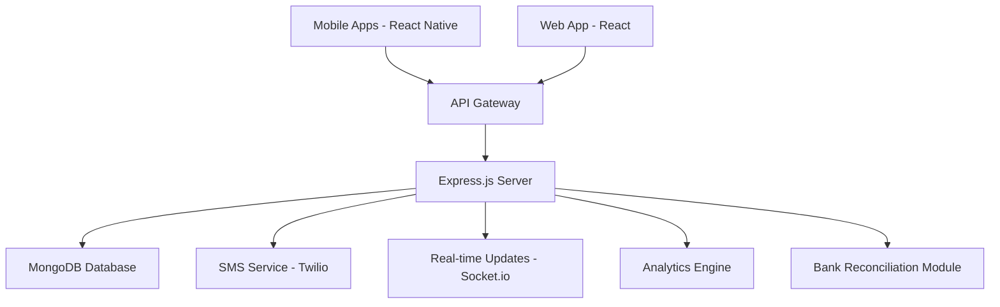

# 🍺 BarTrack POS - Professional Bar Management System

A comprehensive, beautiful, and professional Point of Sale (POS) system designed specifically for bars and restaurants. Built with modern technologies for optimal performance and user experience.


## ✨ Features

### 1. 📊 Sales Management
- **Real-time Sales Processing**: Quick and efficient checkout system
- **Multiple Payment Methods**: Cash, Card, Mobile payments, Credit
- **Invoice Generation**: Automatic invoice numbering and PDF generation
- **Sales History**: Comprehensive sales tracking and reporting
- **Refund Management**: Easy return and refund processing
- **Table Management**: Track orders by table/location

### 2. 📱 Android & iOS Mobile Apps
- **React Native Apps**: Native performance on both platforms
- **Real-time Synchronization**: Instant updates across all devices
- **Offline Mode**: Continue operations even without internet
- **Push Notifications**: Get alerts for important events
- **Mobile POS**: Accept orders and payments on the go

### 3. 💬 SMS Alerts
- **Low Stock Alerts**: Automated notifications when items need reordering
- **Sales Notifications**: Instant alerts for high-value transactions
- **Daily Summaries**: End-of-day reports via SMS
- **Stock Variance Alerts**: Get notified of inventory discrepancies
- **Customer Notifications**: Send order status updates to customers

### 4. 📈 Profit & Loss Analysis
- **Real-time P&L Statements**: Track profitability instantly
- **Revenue Tracking**: Monitor gross and net revenue
- **Cost Analysis**: Track COGS (Cost of Goods Sold)
- **Profit Margins**: Calculate and display profit percentages
- **Period Comparisons**: Compare performance across time periods
- **Category Breakdowns**: Analyze performance by product category

### 5. 👥 User-Friendly Operations
- **Intuitive Interface**: Clean, modern, and easy to navigate
- **Role-Based Access**: Admin, Manager, Bartender, Waiter, Cashier roles
- **Quick Actions**: One-click access to common tasks
- **Search & Filters**: Find items and transactions quickly
- **Keyboard Shortcuts**: Speed up operations for power users
- **Responsive Design**: Works perfectly on all screen sizes

### 6. 🏦 Bank Reconciliation
- **Transaction Matching**: Auto-match bank transactions with sales
- **Reconciliation Reports**: Track reconciled vs unreconciled transactions
- **Multiple Bank Accounts**: Support for multiple business accounts
- **Manual Override**: Manually reconcile complex transactions
- **Reconciliation Rate**: Monitor reconciliation efficiency
- **Audit Trail**: Complete history of all reconciliation activities

### 7. 🆘 24/7 Support
- **Live Chat Widget**: Instant support access
- **Email Support**: Dedicated support email
- **Phone Support**: Direct phone line for urgent issues
- **Knowledge Base**: Comprehensive documentation
- **Video Tutorials**: Step-by-step guides
- **Community Forum**: Connect with other users

### 8. 📦 Stock Variance Identification
- **Real-time Tracking**: Monitor stock movements continuously
- **Variance Detection**: Automatically identify discrepancies
- **Stock Adjustments**: Record and track all adjustments
- **Variance Reports**: Detailed reports on stock variances
- **Cause Analysis**: Track reasons for variances
- **Alerts**: Get notified of significant variances

### 9. 🍽️ Menu Management
- **Easy Item Management**: Add, edit, delete menu items
- **Category Organization**: Organize items by categories
- **Pricing Control**: Set prices and costs for accurate margins
- **Image Upload**: Add photos to menu items
- **Availability Toggle**: Mark items as available/unavailable
- **Recipe Management**: Track ingredients for cocktails
- **Nutritional Info**: Store allergen and nutrition data

### 10. 📊 Stock Management
- **Inventory Tracking**: Real-time stock level monitoring
- **Reorder Alerts**: Automated low stock notifications
- **Purchase Orders**: Create and manage POs
- **Supplier Management**: Track supplier information
- **Stock Movements**: Record all stock transactions
- **Inventory Valuation**: Calculate total inventory value
- **Waste Tracking**: Monitor and reduce waste

## 🏗️ Architecture



## 🛠️ Tech Stack

### Backend
- **Runtime**: Node.js (v16+)
- **Framework**: Express.js
- **Database**: MongoDB with Mongoose ODM
- **Authentication**: JWT (JSON Web Tokens)
- **Real-time**: Socket.io
- **SMS**: Twilio API
- **Email**: Nodemailer

### Frontend (Web)
- **Framework**: React 18
- **Routing**: React Router v6
- **State Management**: React Context + React Query
- **Charts**: Recharts
- **Notifications**: React Hot Toast
- **Icons**: React Icons
- **HTTP Client**: Axios

### Mobile Apps
- **Framework**: React Native
- **Navigation**: React Navigation v6
- **UI Components**: React Native Paper
- **Icons**: React Native Vector Icons
- **Charts**: React Native Chart Kit
- **Storage**: AsyncStorage

### Security & Performance
- **Security**: Helmet.js, bcrypt
- **Compression**: Compression middleware
- **CORS**: CORS middleware
- **Logging**: Morgan
- **Validation**: Express Validator

## 📋 Installation

### Prerequisites
- Node.js (v16 or higher)
- MongoDB (v4.4 or higher)
- npm or yarn
- For mobile: React Native development environment

### Backend Setup

```bash
# Clone the repository
git clone https://github.com/yourusername/BarTrackPOSvs.git
cd BarTrackPOSvs

# Install dependencies
npm install

# Set up environment variables
cp .env.example .env
# Edit .env with your configuration

# Start MongoDB
mongod

# Start the server
npm start
# Or for development with auto-reload
npm run dev
```

### Web Client Setup

```bash
# Navigate to client directory
cd client

# Install dependencies
npm install

# Start the development server
npm start
```

### Mobile App Setup

```bash
# Navigate to mobile directory
cd mobile

# Install dependencies
npm install

# For iOS (macOS only)
cd ios && pod install && cd ..
npx react-native run-ios

# For Android
npx react-native run-android
```

## ⚙️ Configuration

### Environment Variables

Create a `.env` file in the root directory:

```env
# Server
PORT=5000
NODE_ENV=development

# Database
MONGODB_URI=mongodb://localhost:27017/bartrack_pos

# JWT
JWT_SECRET=your_super_secret_jwt_key_here
JWT_EXPIRE=7d

# Twilio (SMS)
TWILIO_ACCOUNT_SID=your_twilio_account_sid
TWILIO_AUTH_TOKEN=your_twilio_auth_token
TWILIO_PHONE_NUMBER=+1234567890

# Email
EMAIL_HOST=smtp.gmail.com
EMAIL_PORT=587
EMAIL_USER=your_email@gmail.com
EMAIL_PASSWORD=your_app_specific_password

# Notifications
MANAGER_PHONE=+1234567890
OWNER_PHONE=+1234567890

# Client
CLIENT_URL=http://localhost:3000
```

## 🚀 Usage

### Default Login Credentials

**Admin Account:**
- Email: admin@bartrackpos.com
- Password: admin123

⚠️ **Important**: Change these credentials immediately in production!

### Creating Your First Menu Item

1. Navigate to **Menu Management**
2. Click **Add New Item**
3. Fill in the details:
   - Name: Corona Beer
   - Category: Beer
   - Price: $5.00
   - Cost: $2.50
   - Stock Quantity: 100
   - Reorder Level: 20
4. Click **Save**

### Processing a Sale

1. Go to **Sales Management**
2. Select items from the menu
3. Enter quantities
4. Choose payment method
5. Click **Complete Sale**
6. Invoice is automatically generated

### Stock Management

1. Navigate to **Stock Management**
2. View current inventory levels
3. Record stock movements:
   - Purchase: Add new stock
   - Waste: Record wastage
   - Adjustment: Fix discrepancies
4. System automatically sends alerts for low stock

## 📊 API Documentation

### Authentication

```javascript
POST /api/auth/login
Body: {
  "email": "user@example.com",
  "password": "password123"
}

Response: {
  "success": true,
  "token": "jwt_token_here",
  "user": { ... }
}
```

### Sales

```javascript
// Create Sale
POST /api/sales
Headers: Authorization: Bearer <token>
Body: {
  "items": [
    {
      "menuItem": "menuitem_id",
      "quantity": 2,
      "discount": 0
    }
  ],
  "paymentMethod": "cash",
  "tableNumber": "T1"
}

// Get Sales
GET /api/sales?startDate=2026-03-01&endDate=2026-03-11
Headers: Authorization: Bearer <token>
```

### Menu

```javascript
// Create Menu Item
POST /api/menu
Headers: Authorization: Bearer <token>
Body: {
  "name": "Corona Beer",
  "category": "Beer",
  "price": 5.00,
  "cost": 2.50,
  "stockQuantity": 100,
  "reorderLevel": 20
}

// Get Menu Items
GET /api/menu?category=Beer&search=corona
Headers: Authorization: Bearer <token>
```

### Stock

```javascript
// Record Stock Movement
POST /api/stock/movement
Headers: Authorization: Bearer <token>
Body: {
  "menuItemId": "item_id",
  "type": "purchase",
  "quantity": 50,
  "unitCost": 2.50,
  "supplier": {
    "name": "ABC Distributors",
    "phone": "+1234567890"
  }
}
```

### Analytics

```javascript
// Get Profit & Loss
GET /api/analytics/profit-loss?startDate=2026-03-01&endDate=2026-03-11
Headers: Authorization: Bearer <token>

// Get Dashboard Overview
GET /api/analytics/dashboard
Headers: Authorization: Bearer <token>
```

## 🔒 Security Features

- **Password Hashing**: bcrypt with salt rounds
- **JWT Authentication**: Secure token-based auth
- **Role-Based Access Control**: Granular permissions
- **Input Validation**: Express Validator
- **SQL Injection Protection**: MongoDB ODM
- **XSS Protection**: Helmet.js
- **CORS Configuration**: Controlled access
- **Rate Limiting**: Prevent abuse (recommended)

## 📱 Mobile App Features

- **Barcode Scanning**: Quick item lookup
- **Offline Mode**: Work without internet
- **Camera Integration**: Capture receipts
- **Biometric Auth**: Fingerprint/Face ID
- **Push Notifications**: Real-time alerts
- **Cloud Sync**: Automatic data sync

## 🤝 Contributing

We welcome contributions! Please follow these steps:

1. Fork the repository
2. Create a feature branch (`git checkout -b feature/AmazingFeature`)
3. Commit your changes (`git commit -m 'Add some AmazingFeature'`)
4. Push to the branch (`git push origin feature/AmazingFeature`)
5. Open a Pull Request

## 📝 License

This project is licensed under the MIT License - see the [LICENSE](LICENSE) file for details.

## 👥 Team & Support

**Development Team:**
- Lead Developer: BarTrack Team
- Contact: bartrack32@gmail.com

**Support:**
- 📧 Email: support@bartrackpos.com
- 📞 Phone: +1-234-567-890
- 💬 Live Chat: Available 24/7
- 🌐 Website: www.bartrackpos.com

## 🎯 Roadmap

### Version 1.1 (Coming Soon)
- [ ] Advanced reporting with custom date ranges
- [ ] Multi-location support
- [ ] Employee time tracking
- [ ] Customer loyalty program
- [ ] Advanced analytics with AI insights

### Version 1.2
- [ ] Integration with accounting software (QuickBooks, Xero)
- [ ] Table reservation system
- [ ] Kitchen display system (KDS)
- [ ] QR code menu ordering
- [ ] Delivery integration (UberEats, DoorDash)

## 🙏 Acknowledgments

- Icons by [React Icons](https://react-icons.github.io/react-icons/)
- UI inspiration from modern POS systems
- Community contributions and feedback

---

**Made with ❤️ by the BarTrack Team**

For more information, visit our [documentation](https://docs.bartrackpos.com) or join our [community forum](https://community.bartrackpos.com).
